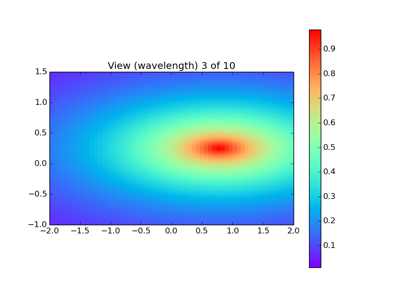

ndiminterpolation
=================

**Author:** Robert Nikutta

**Version:** 2014-12-02

**License:** BSD 3-clause, please see [LICENSE](./LICENSE) file



Implements NdimInterpolation class and helper functions. Performs fast
*multi-dimensional* interpolations of models (in arbitrary dimensions)
on *rectilinear* grids (i.e. the pre-computed input grid of pivots
need not be equidistantly spaced, or regular, but only
orthogonal). Especially useful for SED interpolation, since by default
the interpolation is for a 1-d input array of values (think of
wavelength list). Implemented schemes: multi-linear, and cubic-spline.

This module contains a (slightly) interactive `example()`
function. Run like this:

```
    ipython --pylab
    In[0]: import ndiminterpolation as nd
    In[1]: ip, datacube, theta, mywave = nd.example()
````

`example.png` is a preview of what you will see.
